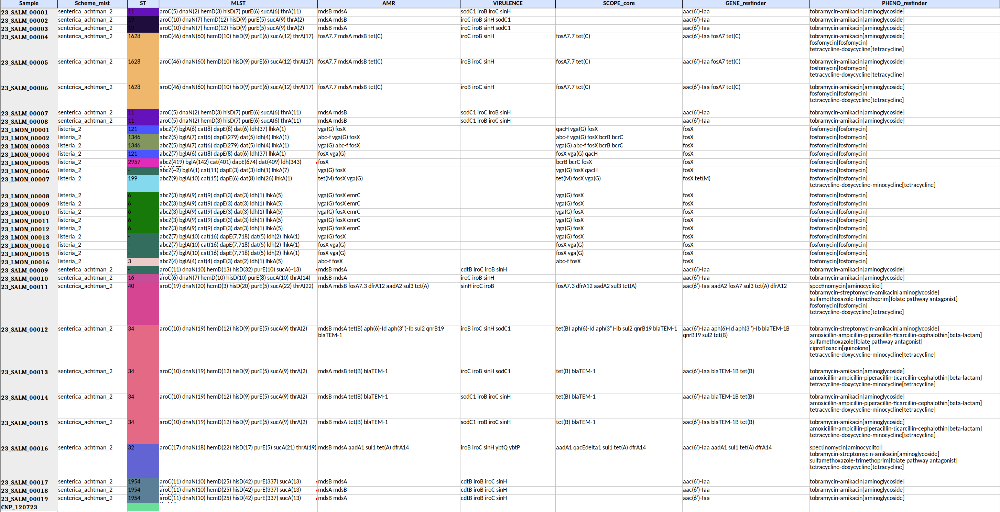
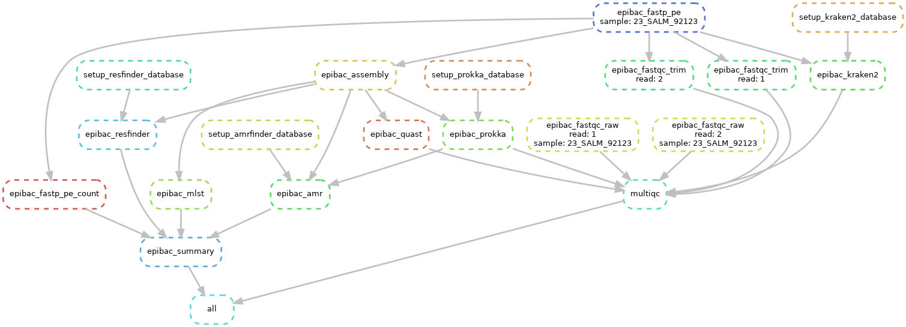

# EPIBAC

Pipeline for basic bioinformatic analysis of bacteria and study of AMR and MLST.

Example of the excel obtained as analysis results from a run.





Este pipeline se ha probado en las distribuciones de Linux [Ubuntu 20.04.6 LTS (Focal Fossa)](https://releases.ubuntu.com/focal/) y [Ubuntu 22.04.3 LTS (Jammy Jellyfish)](https://releases.ubuntu.com/jammy/).


# Instalación de CONDA

```bash
# Creamos directorio donde tendremos instalado CONDA (donde tengamos permisos de escritura)
mkdir -p ~/miniconda3
# Descargamos última versión
wget https://repo.anaconda.com/miniconda/Miniconda3-latest-Linux-x86_64.sh -O ~/miniconda3/miniconda.sh
# Damos permisos al script de instalación
chmod u+x ~/miniconda3/miniconda.sh
# Instalamos de manera desatendida
bash ~/miniconda3/miniconda.sh -b -u -p ~/miniconda3
# Borramos archivo de instalación
rm -rf ~/miniconda3/miniconda.sh
```

## Nos aseguramos de realizar configuración inicial correctamente

Activamos conda:
```bash
source ~/miniconda3/etc/profile.d/conda.sh
```

Configuramos PROXY GVA en CONDA (en caso que haga falta)
```bash
conda config --set proxy_servers.http http_proxy=http://proxy.san.gva.es:8080
conda config --set proxy_servers.https http_proxy=http://proxy.san.gva.es:8080
```

Añadimos un par de canales básicos como repositorios de paquetes de instalación
```bash
conda config --add channels bioconda
conda config --add channels conda-forge
```

Cambiamos opciones de prioridad de canales
```bash
conda config --set channel_priority strict
```

Actualizamos conda:
```bash
conda update -n base -c defaults conda
```

Configuramos conda para que se inicie automáticamente en nuevos shells:
```bash
conda init
```

Este comando configurará conda para que se inicie automáticamente cuando abres una nueva terminal.


> [!NOTE]
> Cerramos la terminal y abrimos una nueva, para asegurarnos de que los cambios surtan efecto.


Veremos que en el `prompt` nos ha salid el prefijo `(base)` delante de nuestro usuario y máquina: `(base) usuario@máquina:$`.

Ya estamnos en la "anarquía" de CONDA ;), poder instalar paquetes sin permisos de administrador.


# Instalamos MAMBA, como gestor de paquetes en base (ambiente inicial de CONDA)
```bash
conda install mamba
```

# Creamos ambiente de SNAKEMAKE

Éste será el primer ambiente que instalemos que llamaremos `snake`. Al instalarlo con `mamba`, irá mucho más rápido.

```bash
mamba create -n snake -c conda-forge bioconda::snakemake=7.32 bioconda::snakemake-minimal=7.32 snakemake-wrapper-utils pandas openpyxl
```

## Cargamos ambiente SNAKE
```bash
conda activate snake
```
Veremos que el prefijo de `(base)` a cambiado a `(snake) usuario@máquina:$`. Deberemos cargar este ambiente siempre que querramos lanzar un pipeline de Snakemake.


# Puesta a punto pipeline EPIBAC

Es importante realizar los siguientes pasos en un sitio en el que tengamos al menos 50 GBs de espacio. El fichero de instalación GIT no ocupa mucho, pero sí que ocupa más los programas y bases de datos instalados.

La instalación ocupa un mínimo de 26 GB, por lo que mínimo, para lanzar una carrera de Illumina, se necesitarían unos 70 GB - 100 GB.

En posteriores reuniones se hablará de la salida de datos que les interesa a los Hospitales. En caso de sólo querer el informe final, manteniendo siempre una copia de los `RAW_DATA`, se podría reducir algo el espacio final necesario. 


## Clonamos repositorio GIT con el pipeline y los ficheros de prueba
```bash
git clone https://github.com/EpiMol/epibac.git
```

## Corremos test de prueba que también nos servirá para instalar todos los programas necesarios y bases de datos
```bash
# Nos situamos dentro de la carpeta "epibac"
cd epibac	
```

Con la configuración actual es importante ejecutar todos los trabajos desde el mismo directorio, para no volver a instalar todos los recursos y bases de datos.
Snakemake los instalaría en una carpeta oculta llamada `.snakemake`, 

Si vamos cambiando de carpeta cada vez, estaríamos generando una nueva instalación desde cero.

Para cambiar de carrera, sería modificar el fichero `config.yaml` o modificar los directorios de ejecución al ejecutar el comando.

```bash
snakemake --config samples=test/samplesheet.tsv outdir=test/out logdir=test/log --use-conda -j 8
```

Aquí analizaremos una muestra anonimizada para comprobar que todos los pasos se realizan correctamente.

En el siguiente gráfico se muestra el esquema básico de trabajo para una muestra. Los pasos como instalación de las bases de datos sólo se realizaría una vez.





Y el resultado debería dar:

| | | | | | | | | |
|-|-|-|-|-|-|-|-|-|
|Sample|Scheme_mlst|ST|MLST|AMR|VIRULENCE|SCOPE_core|GENE_resfinder|PHENO_resfinder|
|23_SALM_92123|senterica_achtman_2|1628|aroC(46) dnaN(60) hemD(10) hisD(9) purE(6) sucA(12) thrA(17)|fosA7.7 mdsA mdsB tet(C)|iroB iroC sinH|fosA7.7 tet(C)|aac(6')-Iaa fosA7 tet(C)|tobramycin-amikacin[aminoglycoside] fosfomycin[fosfomycin] tetracycline-doxycycline[tetracycline]|


## Relanzar pipeline
En caso de que hubiéramos tenido algún error podríamos volver a intentar lanzar el pipeline añadiendo la opción `--rerun-incomplete`
```bash
snakemake --config samples=test/samplesheet.tsv outdir=test/out logdir=test/log --use-conda -j 8 --rerun-incomplete
```


## Fichero config.yaml

Se especifica el número de procesadores (threads), RAM (MB), o tiempo máximo de ejecución de un proceso (minutos). Snakemake es un gestor de flujos de trabajo, por loque se podrá aprovechar el máximo potencial de nuestras máquinas.

Nótese que en el comando de ejemplo hemos especificado `-j 8`, eso es porque le hemos permitido a Snakemake emplear hasta un máximo de 8 CPUs.

Por lo tanto en equipos más potentes, con CPUs más rápidas y un mayor número de hilos, podremos obtener antes los resultados. Si tenemos un procesador i7-11700, con 8 cores / 16 threads, perfectamente podremos indicarle `-j 12`, teniendo en cuenta de reservar algo para nuestro aguantar nuestro sistema operativo y uso normal básico.

Durante las ejecuciones de los análisis es posible que notemos alguna ralentización del sistema.

En caso de correr los análisis bajo un entorno virtual como `VirtualBox`, habrá que tener en cuenta este coste, de mantener dos sistemas operativos en una misma máquina y tal vez reducir el número de procesadores empleados en `-j`.

## Ejecución SNAKEMAKE + SLURM
Snakemake permite la integración con SLURM, a falta de configurar, para lanzar todos los trabajos por el gestor de colas. Haría falta una configuración adicional, no planteada en esta primera versión.

[Snakemake Documentation on Cluster Execution](https://snakemake.readthedocs.io/en/stable/executing/cluster.html)


# Autores

- Alejandro Sanz-Carbonell
- Irving Cancino-Muñoz
- Fernando González-Candelas
